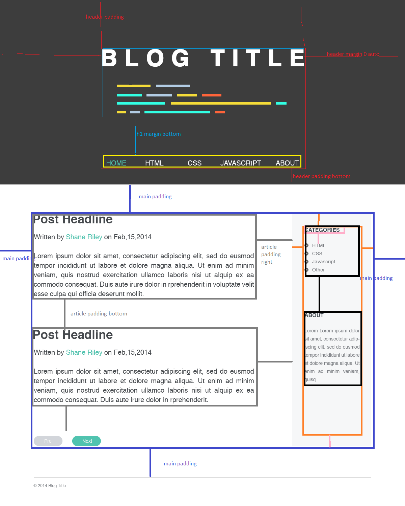

## HTML coding proactices

1. css id is unique
- id is unique
- class can be duplicated

2. use semantic element
- use h1, p, strong, div
- no br, span

3. strucutre
- html = head + body

4. syntax
- lowercase 
- indent
- always double quotes
- no / at the end of self-closing element

5. use alt text attribute on images

6. separate style

7. avoid too many div, reduce markup

8. continually refactor code


## CSS coding practises

1. Comments
- commments on top of each style /* Primary header */

2. multiple lines
- one property per line

3. class name
- lowercase
- use hyphen delimiters

4. selectors
- avoid id selector
- use class selector
- only 2 or 3 level nested, specific class if needed

5. prefer shorthand

6. prefer 3-char shorthand hex color

7. drop units from 0
- use 0
- not 0px or 0%

8.  Group & Align Vendor Prefixes

#### performance

- keep selector short
- seperate content from container
- favor classes
- image Sprites


## Tips

#### input and textarea not take body font

```css
textarea, input, button, select { 
  font-family: inherit; font-size: inherit; 
}
```

#### padding and margin


#### when to use background-image vs img element
- img element is part of structure
- background-image is style/design, appear only when there is styling, not appear if fails to load or another style

> LauncheSchool TA: img: As part of the structure these are images that you'd want to be present regardless if css/styling is present or fails to load.  An example of something that maybe considered as part of the structure is the logo of the company.


#### trick of checkbox pseudo class to affect sibling

 Maybe it could be for a drop down menu, or an accordion of more information that animates using CSS. There are many occasions when you will want to toggle the state of an element based on clicking another, and unless your changes affect more than one element, you will likely be able to use this trick to accomplish it. Remember that the label's for attribute can link to a hidden checkbox input in a completely different part of the layout, so a clickable area in the left side of the screen can affect the checkbox located along with an element on the right side of the screen.

####  Convert a design to html / css



start from big picture: header -> main (content, navbar) > footer

padding and margin

1. padding on outter element
2. margin-bottom on otter element

styling

1. css reset
2. common style, most in type: body, h1-h2, li, a, p 
3. water fall header -> main -> footer

**if anything common, move above as general type style**

#### Photoshop PSD
- Auto select
- Select all (Ctrl-a or Cmd-a)
- Copy merged (Shift-Ctrl-c or Shift-Cmd-c)
- New file (Ctrl-n or Cmd-n)
- Enter to confirm
- Paste (Ctrl-v or Cmd-v)
- Save for web (Ctrl-alt-shift-s or Cmd-opt-shift-s)


#### how to cut corner

left/top or right/bottom

```css
div:before {
    content: '';
    position: absolute;
    top: 0; 
    right: 0;
    border-top: 100px solid white;
    border-left: 100px solid transparent;
}
```

#### triangles

https://css-tricks.com/snippets/css/css-triangle/


#### Shorthand property

- background: color image no/repeat v-pos(top, center bottom) h-pos(left, center, right)


```css
div {
  background-color: #000;
  background-image: url(images/bg.gif);
  background-repeat: no-repeat;
  background-position: top right;
}

div {background: #000 url(images/bg.gif) no-repeat top right;}
```

- font: style weight size/height family

```css
p {
  font-style: italic;
  font-weight: bold;
  font-size: .8em;
  line-height: 1.2;
  font-family: Arial, sans-serif;
}
p {
  font: italic bold .8em/1.2 Arial, sans-serif;
}
```

#### vertical-align

http://phrogz.net/css/vertical-align/index.html

http://christopheraue.net/2014/03/05/vertical-align/


- in table cells (container). bottom: content showing just above **bottom edge of cell**
- on inline elements (inside). align siblings with **botton edge** 

#### how to vertical center inline or inline-block

Assumption: set vertical-align on inline element. **align to its `parent` edge**


#### how to vertical center block 

Assumption: fixed height on `child`
- set `child` position:absolute, top:50%;
- set `parent` margin-top:-1/2 child height;


#### how to vertical center on block
Assumption: fixed height on `parent`
- set parent `line-height` 

#### common shorthand 
- font: italic bold .8em/1.2 Arial, sans-serif;
- font:normal 16px Helvetica, Arial, sans-serif;
- background: #000 url(images/bg.gif) no-repeat top right;
- border: 1px dashed gray

#### gradient
- linear-gradient() repeating-linear-gradient()
- radial-gradient() repeating-radial-gradient()


#### submit button to flat

```css
.button {
  text-shadow:none !important;
  border:none !important;
  box-shadow:none !important;
}
```


#### element messy layout

- check float
- check overflow on container
- do clearfix by overflow:hidden on container + :after {}
- check z-indexs