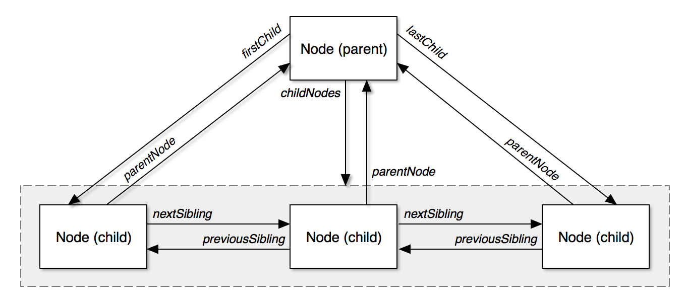

[W3C DOM Standard](https://www.w3.org/DOM/)

[How browsers work](http://taligarsiel.com/Projects/howbrowserswork1.htm)

[What is DOM](https://www.w3.org/TR/DOM-Level-2-Core/introduction.html)

[Introduction to the DOM](https://developer.mozilla.org/en-US/docs/Web/API/Document_Object_Model/Introduction)

[The Basics of JavaScript DOM Manipulation](http://callmenick.com/post/basics-javascript-dom-manipulation)

[DOM Viewer](https://dom-viewer.herokuapp.com/)

# Douglas Crockford Lecture: The Metamorphosis of Ajax
# Douglas Crockford: An Inconvenient API - The Theory of the DOM

https://www.youtube.com/watch?v=Fv9qT9joc0M

https://www.youtube.com/watch?v=Y2Y0U-2qJMs


## DOM - browser's API

document.write *Bad*
- allow JS to produce html text

script tag
- big impact on page loading times
- place `script` to the bottom of `body` as possible, and place css `link` as high in the `head` as possible

## Document Tree Structure

```
#document `document`
  |----html `document.`
      |----head `documentElement`
      |----body `document.body`
            |----h1
            |    |----#text  
            |----p
            |    |----#text
            |----p
                |----#text

```

## child, sibling, parent
- `firstChild` `lastChild`
- `previousSibling` `nextSibling`
- `parent`
- should be enough just `firstChild`, `nextSibling`, like a`p` and `p->next`





## Walk the DOM


## Retrieving Nodes
- `document.getElementsById(id)` // efficient
- `document.getElementsByClassName(className)`
- `document.getElementsByName(name)`
- `node.getElementsByTagName(tagName)`

## Manipulating Elements
- change node peroperties, e.g. border, align, width,...
- or getAttribute, setAttribute

## Style

W3C and EMCA doesn't cooprate

CSS (dash)
- background-color
- border-radius

JavaScript (camel)
- backgroundColor
- borderRadius

Making Elements
- `document.createElement(tagName)`
- `document.createTextNode(text)`
- `node.cloneNode()`
- `node.cloneNode(true)` // all of its descendents
- *the new nodes are not connected to the document*

Linking Elements
- `node.appendChild(new)`
- `node.insertBefore(new, sibling)`
- `node.replacerChild(new, old)`
e.g. `old.parentNode.replaceChild(new, old)`


Removing Elements
- `node.removeChild(old)`
e.g. `old.parentNode.removeChild(old)`

Event

- browser:
  - **event-driven**
  - **single-threaded**
  - **async programming model**

- event
  - targeted on particular nodes
  - invoke event handler function

Event handlers
- Netscape `node["on" + type] = f`
- MS `node.attachEvent("on" + type, f)`
- w3c `node.addEventListener(type, f, false)`

Trickling
- old

Bubbling
- event is given to the target node
- then its parent
- then its parent
- until cancelled

Cancel the Bubbling

Performance
- touching e.g. visit/access node
- styling e.g. search thru cascade
- reflow
- repaint
- random things like nodelist

- but JS has a small cost
- most cast is in DOM

- slow: append every single node is slow => lots of reflow
- fast: compose a big node structure and attach to the top => just one reflow


Chrome Speed Tracer
IE dynaTrace

measure before optimazing

## Ajax discovered 2005

- A easy way to transform the DOM

Ajax Library
- portability
  + cross browsers
- correction
- model
- widgets


HTML5
- a big step in the wrong direction

# Q&A

How to detect the node type in JS?

```js
> p instanceof HTMLElement
= true
> p instanceof Element
= true
> p instanceof Node
= true
> p instanceof SVGElement
= false
```

How to convert HTMLCollection or NodeList to JS Array?
- `var arr = Array.prototype.slice.call(htmlCollection)`
- `var arr = [].slice.call(htmlCollection)`


textContent vs value vs innerText vs innerHtml
- `Node.textContent` property represents the text content of *a node and its descendants*.
- `Node.innerText` is a property that represents the *"rendered" text* content of *a node and its descendants*
- `textarea.value` form controls
- `innerText` will not include text that is hidden by CSS, but textContent will.


