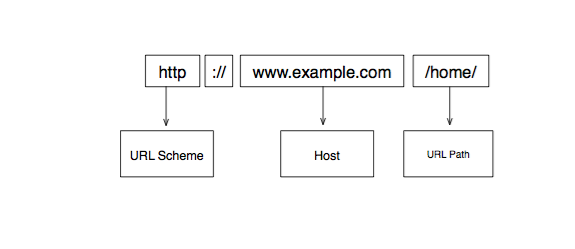
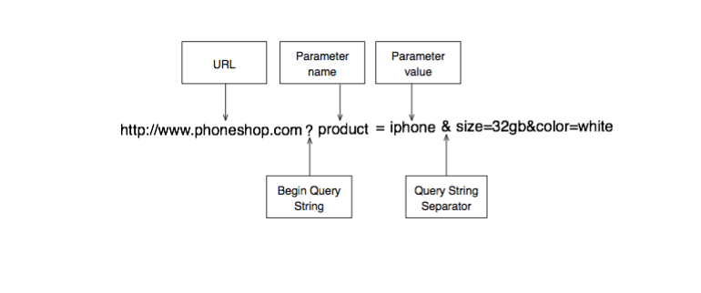

HTTP
-------------

Hypertext Transfer Protocol
  - stateless
  - trick to make user feel application is stateful
  - default port 50

DNS (Domain Naming System)
- URL -> IP address
- distributed database
- DNS servers routes to another DNS up the hierarchy until found IP

>It is important to know that there is a very large world-wide network of hierarchically organized DNS servers, and no single DNS server contains the complete database. If a DNS server does not contain a requested domain name, the DNS server routes the request to another DNS server up the hierarchy. Eventually, the address will be found in the DNS database on a particular DNS server, and the corresponding IP address will be used to receive the request.

URL (Uniform Resource Locator address) or URI (Uniform Resource Identifier resources)
  - alphanumeric
  - $-_.+!'()," convert to % and 2 HEX

Query parameters
- e.g. http://www.example.com?search=ruby&results=10
- ?,	This is a reserved character that marks the start of the query string
- search=ruby,	This is a parameter name/value pair.
- &,	This is a reserved character, used when adding more parameters to the query string.
- results=10,	This is also a parameter name/value pair.

Query params limitations
- a maximum length
- name/value pairs are visible, can't pass sensitive info like username, password
- Space and special characters like & cannot be used (must be URL encoded)

URL Encoding

## HTTP
- HTTP as a stateless protocol, web developers have to work hard to simulate a stateful experience in web applications.

GET
- GET requests are used to retrieve a resource, and most links are GETs.
- The response from a GET request can be anything, but if it's HTML and that HTML references other resources, your browser will automatically request those referenced resources. A pure HTTP tool will not.
- There are size and security limitations to using GET requests.

- idempotent, read multiple times whith same results
- should never be useed to chagne database
- safe
- **most links are get**
- size/security limitation

POST (when submitting a form)
  - not idempotent
  - Repeated POST calls will create multiple users
  - **to submit a form**
  - body: larger information than GET

PUT
  - idempotent, update multiple times which same results

DELETE
  - idempotent

Request

- URL
- parameters
- headers
- message body (for POST requests)

Response
- Content-Encoding
- Server
- Content-Type
- Location // new resource location, redirect

status code - 3-digit number

200	OK
302	redirect
404	Not Found
500	server side issue

>
> 1×× Informational
> 2×× Success
> 3×× Redirection
> 4×× Client Error
> 5×× Server Error
>

## debug

PostMan, DevTool Network Tab, cURL, Fiddler

## stateful web application

- sessions
  - session data by id
  - server check session expiration

- cookies
  - server sent session information via response header 'set-cookie'
  - store in browser cookie
  - append to request header if has 'cookie'

- AJAX = async js and xml
  - no full page refresh

## security

- https
  - SSL (Secure Sockets Layer) early https
  - TLS (transport layer security) now a days

- same-origin policy

- cross-origin resource sharing (CORS)

- session hijecking
  - hacker use the local cookie to login without knowing username/password

- cross-site scripting (XSS)
  - inject via input, form
  - sanitize user input, <script> tag, html+js

## TODO
- [.] config curl